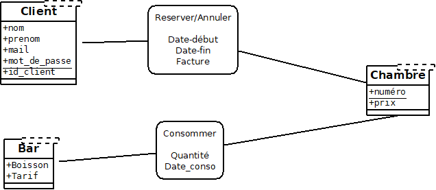

# Introduction
L'objectif de ce rapport est de présenter l'avancement de la base de données
dans son état actuel avant la création d'un site permettant de faire interface
avec celle-ci.

Notre base de données reprend le fonctionnement d'un hôtel avec plusieurs modules de bases comme pour les transactions, la location de chambres et des modules complémentaires comme le bar.

\pagebreak
# BDD
## Fonctionnalités
La base de données dans son état actuel peut se représenter sous la forme suivante :


Parmi les fonctionnalités présente il y a :

+ la réservation/annulation de chambres
+ la consommation au bar
+ le règlement des factures

Je vais détailler le fonctionnement de chacune de ces fonctionnalités dans cette partie.

Cependant il faut d'abord un peu détailler la table Client, qui représente quand même l'axe central de notre base.

### Client
La table client est une table relativement simple qui prend comme attribut :
+ nom
+ prenom
+ mail
+ mot de passe
+ id_client

Ici l'attribut "id_client" représente la clé primaire de cette table.

Celle ci est donc de la forme :

```SQL
CREATE TABLE Hotel.Client (
  idClient serial NOT NULL,
  nom text NOT NULL,
  prenom text NOT NULL,
  mail text NOT NULL,
  password text NOT NULL,

  PRIMARY KEY (idClient),
  UNIQUE (mail)
);
```

Les champs nom, prenom, et mail servent à l'identification du client autrement que par son ID. Le champ password servira alors au client sur le site afin qu'il puisse s'y connecter.

Nous aurions pu prendre l'adresse mail comme clé primaire de la table cependant, le choix d'un identifiant unique "idClient" a été fait pour permettre la création de plusieurs comptes et ainsi plusieurs reservations autour de la même adresse mail.

### Réservation/Annulation
La réservation et l'annulation d'une chambre passent par deux tables (en plus de la table client évidemment) : la table Reservation et la table Chambre.

La table Reservation fait la jonction entre le client et la chambre, elle est censée gérer la date de début et de fin d'une réservation, le règlement, et la date de règlement. La clé primaire de cette table est "idFacture". Les clés étrangères des tables Client et Chambre sont respectivement "idClient" et "idChambre".

Elle est de la forme suivante :
```SQL
CREATE TABLE Hotel.Reservation (
  idFacture serial NOT NULL,
  idClient serial NOT NULL,
  idChambre serial NOT NULL,
  date_debut date NOT NULL,
  date_fin date NOT NULL,
  reglee boolean NOT NULL,
  date_reglement date NOT NULL DEFAULT 'epoch',

  PRIMARY KEY (idFacture),
  UNIQUE (idClient, idChambre, date_debut),
  UNIQUE (idClient, idChambre, date_fin),

  FOREIGN KEY (idChambre) REFERENCES Hotel.Chambre(idChambre),
  FOREIGN KEY (idClient) REFERENCES Hotel.Client(idClient),


  CHECK (date_debut < date_fin),
  CHECK ((not reglee) or (date_reglement>=date_fin))
);
```

On peut y remarquer qu'il y a deux vérifications qui permettent de contrôler si la date de fin saisie est supérieure à la date du début. Et si la date de règlement est supérieure ou égale à la date de fin afin que le client ne puisse pas payer avant la fin de sa réservation.

La table chambre est une table simple qui permet de stocker la liste des chambres de par leurs numéros "idChambre" (qui est aussi la clé primaire) et le tarif de la chambre :

```SQL
CREATE TABLE Hotel.Chambre (
  idChambre serial NOT NULL,
  tarif integer NOT NULL CHECK (tarif > 0),

  PRIMARY KEY (idChambre)
);
```

### Consommation
La consommation au bar passe aussi par deux tables de nomination assez explicite Consommation et Bar.

Comme pour la réservation d'une chambre, la table Consommation fait la jonction entre la table Bar et la table Chambre. Elle gère la quantité de boisson consommée, la date de consommation, le type de boisson et l'identifiant de la chambre "idChambre" car la consommation au bar est liée à une chambre.
La clé primaire de cette table est le jour de la consommation. Cela nous permet notamment de savoir quelle quantité a été consommé sur quel jour, pour ensuite lier le jour à la période d'occupation d'une chambre afin d'en déduire une facture.

On la retrouve sous la forme suivante :
```SQL
CREATE TABLE Hotel.Consommation (
  idChambre serial NOT NULL,
  jour date NOT NULL,
  boisson text NOT NULL,
  quantite integer NOT NULL CHECK (quantite > 0),

  PRIMARY KEY (idChambre, jour, boisson),

  FOREIGN KEY (idChambre) REFERENCES Hotel.Chambre(idChambre),
  FOREIGN KEY (boisson) REFERENCES Hotel.Bar(boisson)
);
```

De la même manière que la table chambre, la table Bar sert à répertorier les différentes consommations et leurs tarifications. La clé primaire de cette table est l'attribut "boisson".

```SQL
CREATE TABLE Hotel.Bar (
  boisson text NOT NULL,
  prix integer NOT NULL CHECK (prix > 0),

  PRIMARY KEY (boisson)
);
```
Dans cette table l'entrée d'une nouvelle boisson ne peut être faite que si son prix est supérieur à 0€ `prix integer NOT NULL CHECK (prix > 0)`.

### Facturation
Nous avons fait le choix de ne pas passer par la création d'une table propre permettant la facturation car il était tout aussi efficace d'intégrer la facturation directement dans la notion de réservation étant donné que la facturation des consommations est liée à la chambre et un client a sa réservation liée à la même chambre.

C'est pourquoi nous pouvons retrouver l'attribut "idFacture" dans la table réservation :
```SQL
CREATE TABLE Hotel.Reservation (
  idFacture serial NOT NULL,
  idClient serial NOT NULL,
  idChambre serial NOT NULL,
  date_debut date NOT NULL,
  date_fin date NOT NULL,
  reglee boolean NOT NULL,
  date_reglement date NOT NULL DEFAULT 'epoch',

  PRIMARY KEY (idFacture),
  UNIQUE (idClient, idChambre, date_debut),
  UNIQUE (idClient, idChambre, date_fin),

  FOREIGN KEY (idChambre) REFERENCES Hotel.Chambre(idChambre),
  FOREIGN KEY (idClient) REFERENCES Hotel.Client(idClient),


  CHECK (date_debut < date_fin),
  CHECK ((not reglee) or (date_reglement>=date_fin))
);
```

## Contraintes
Une des plus grosses problématiques qui nous a été donné avec cette base est celle de la gestion de la superposition des dates de réservation. Par exemple, une personne ne devrait pas pouvoir réserver une chambre pendant la même période où elle est déjà occupée.

Pour ce faire nous avons ajouter une contrainte pour la table Reservation :
```SQL
ALTER TABLE Hotel.Reservation ADD CONSTRAINT DatesPossibles
  CHECK(Hotel.DatesCorrectes(idfacture,idChambre, date_debut, date_fin));
```
Cette contrainte fait appel à une fonction que nous avons créée :
```SQL
CREATE FUNCTION Hotel.DatesCorrectes(integer, integer, date, date)
  RETURNS boolean AS $$
SELECT NOT EXISTS (
  SELECT *
  FROM Hotel.Reservation
  WHERE $1 != idFacture
    AND $2 = idChambre
    AND $3 <= date_fin
    AND $4 >= date_debut)
$$ LANGUAGE SQL;
```
Cette fonction qui prend en paramètre les attributs idfacture, idChambre, date_debut et date_fin réalise toutes les comparaisons nécessaires à la vérification de la superposition des dates.

Nous avons pu vérifier le fonctionnement de tout cela en ajoutant des plages de dates superposées dans notre fichier d'insertion :
```SQL
INSERT INTO Hotel.Reservation
  VALUES(DEFAULT,1,1,'2019-10-21','2019-11-15',FALSE, DEFAULT);
  VALUES(DEFAULT,2,1,'2019-10-22','2019-11-14',FALSE, DEFAULT);
```
*NB: Je voulais inserer une capture d'écran du résultat mais depuis quelques temps il m'est impossible de me connecter au postgresql du Cremi.*

### Problèmes rencontrés
Un des problèmes que je n'ai pas su résoudre est celui de l'ajout d'une fonction permettant de vérifier la disponibilité d'une consommation. Je n'ai pas su l'implémenter car je n'ai pas bien compris de quoi il en retournait et j'ai préféré ne pas faire quelque chose au hasard.


\pagebreak
# Conclusion
La BDD dans son état actuellement est fonctionnelle : elle réalise correctement l'ajout de chambres, de boissons et de clients, les clients peuvent  correctement demander à réserver une chambre sauf quand celle-ci n'est pas disponible, et commander une boisson du bar depuis l'identifiant de leur chambre. Pour finir la facture est bien associée à un client par le biais de la table Réservation.

Je pense qu'il y aura besoin de quelques ajustements dans le futur pour les besoins du site web, mais il s'agira d'ajustements mineurs. Il faudra tout de même que j'intègre la notion de contrainte relative aux boissons.
