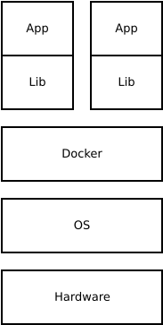
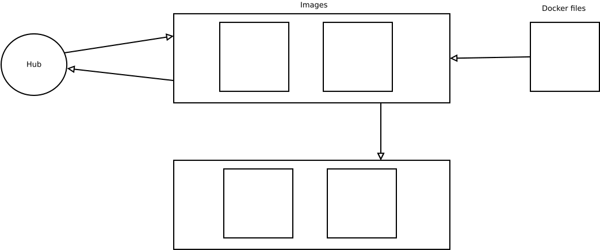

# Les conteneurs
Sur un plan technique une conteneur se situe juste au dessus de l'OS.

Un conteneur gère l'accès, le stockage et le parcours.

## Docker



Docker est un outil qui peut empaqueter une application et ses dépendances dans un conteneur isolé, qui pourra être exécuté sur n'importe quel serveur ». Il ne s'agit pas de virtualisation, mais de conteneurisation, une forme plus légère qui s'appuie sur certaines parties de la machine hôte pour son fonctionnement. Cette approche permet d'accroître la flexibilité et la portabilité d’exécution d'une application, laquelle va pouvoir tourner de façon fiable et prévisible sur une grande variété de machines hôtes, que ce soit sur la machine locale, un cloud privé ou public, une machine nue, etc. . https://fr.wikipedia.org/wiki/Docker_(logiciel)

Docker base son fonctionnement sur un principe d'images. Il existe un DockerHub qui est un endroit communautaire dans lequel on va pouvoir retrouver à la manière d'un git, beaucoup d'images Docker.



Sur le diagramme ci dessus nous pouvons y comprendre le fonctionnement d'un hub, qu'il soit perso ou pas. Le principe de fonctionnement est très proche d'un git. Nous avons un dépôt dans lequel sont stockées des images, depuis lequel nous pouvons récuperer les images pour créer des instances dockers.

Sur Docker il n'y a pas de redondance des données, si on ne creer pas de volume ou de 'bind', si on éteind notre Docker on perd les données stockées.

## TP

`sudo apt install docker.io`

### Creation d'un serveur web dans docker
https://www.tecmint.com/install-apache-web-server-in-a-docker-container/

Creation de notre conteneur d'application :

`sudo docker run -dit --name MONSERVEURWEB -p 8080:80 -v /home/user/website/:/usr/local/apache2/htdocs/ httpd:2.4`

+ L'option --name nous permet de spécifier le nom de notre conteneur.
+ L'option -p permet de faire de la redirection de port. Dans notre cas le port 8080 de notre machine va rediriger vers le port 80 de notre conteneur.
+ L'option -v permet de lier notre répertoire local `/home/user/website/` au répertoire `/usr/local/apache2/htdocs/` de notre conteneur. Ainsi nous pouvons ajouter des fichiers localement dans `/home/user/website/` afin d'ajouter des fichiers dans notre serveur web.
+ Et finalement `httpd:2.4` va dire de recuperer l'image correspondante à cette application. Dans un premier temps l'image va être cherché en local, mais étant donnée qu'elle n'éxiste pas, il va la chercher en ligne. (c bô)

### Utilisation de "docker-compose"
Le but ici est de créer un serveur web Wordpress et une base de donnée mysql et de faire fonctionner les deux ensemble grâce à docker-compose.

`sudo apt-get install docker-compose`

https://hub.docker.com/_/wordpress/

Creer un fichier de configuration :

```
version: '3.1'

services:

  wordpress:
    image: wordpress
    restart: always
    ports:
      - 8080:80
    environment:
      WORDPRESS_DB_HOST: db
      WORDPRESS_DB_USER: exampleuser
      WORDPRESS_DB_PASSWORD: examplepass
      WORDPRESS_DB_NAME: exampledb
    volumes:
      - wordpress:/var/www/html

  db:
    image: mysql:5.7
    restart: always
    environment:
      MYSQL_DATABASE: exampledb
      MYSQL_USER: exampleuser
      MYSQL_PASSWORD: examplepass
      MYSQL_RANDOM_ROOT_PASSWORD: '1'
    volumes:
      - db:/var/lib/mysql

volumes:
  wordpress:
  db:
```

Puis lancer la commande : `docker-compose -f stack.yml up`. Cette commande va composer et lancer des applications multi-conteneurs depuis le fichier de configuration que nous lui avons passer avec l'argument -f.
